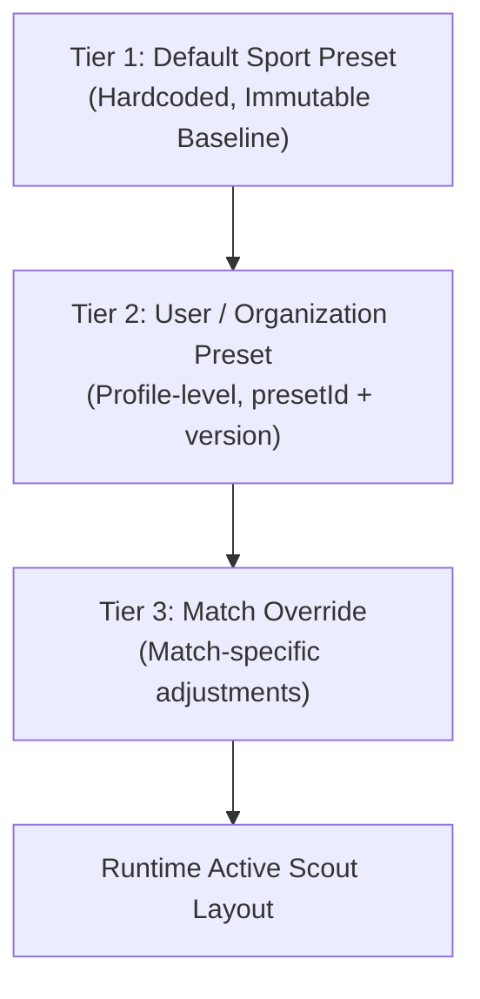

# Scout Custom Mode Architectural Specification

## 1. Executive Summary & Product Mission

SportsScout is a match scouting, video analysis, and tactical review workstation (`Scout → Review → Analyze → Report`). As governed by `AGENTS.md`, the core app is a high-density, real-time sports workstation.

This document specifies **Scout Custom Mode** for configurable scouting keypads, button layouts, and action taxonomies. 

> [!IMPORTANT]
> **Specification-Only Scope Gate**: In this development iteration, this document serves exclusively as the architectural and contract specification. No custom layout editor UI is implemented, and no scoring engine rules are altered.

---

## 2. Configuration Hierarchy

Scout configurations follow a strict three-tier precedence hierarchy. Every action button, shortcut, and category is resolved deterministically at runtime.



### 2.1 Tier 1: Default Sport Preset (Immutable Baseline)
- Bundled directly with SportsScout codebase per sport (e.g., `badminton_singles_default`, `badminton_doubles_default`, `football_default`).
- Read-only; cannot be edited or deleted by users.
- Provides the canonical fallback for every action ID, default shortcut key, and scoring attribution rule.

### 2.2 Tier 2: User / Team Preset (Custom Profile)
- Created, cloned, and modified by analysts, coaches, or clubs.
- Stored persistently in user/organization storage (e.g., IndexedDB / backend profile).
- Uniquely identified by `presetId` and an integer `version`.
- Allows reordering, hiding unused actions, adding custom analytical tags, and remapping keyboard shortcuts.

### 2.3 Tier 3: Match Override (Instance-Level)
- Temporary or match-pinned tweaks applied to a specific fixture (e.g., scouting an opponent with a unique serve tell or idiosyncratic error).
- Stored within the `MatchManifest` metadata without mutating Tier 2 presets.
- Overrides Tier 2 and Tier 1 properties for that match only.

### 2.4 Inheritance & Resolution Strategy
Properties merge with field-level granularity:
$$\text{ResolvedAction}(id) = \text{Merge}(\text{Tier1}[id], \text{Tier2}[id], \text{Tier3}[id])$$
If an analyst hides an action in Tier 2, Tier 3 can re-enable it. If an attribute (e.g., color token or icon) is not defined in Tier 3 or 2, it falls back to Tier 1.

---

## 3. Customization Schema Contract

```typescript
export interface ScoutPresetMetadata {
  presetId: string;             // e.g. "preset-badminton-singles-pro-v1"
  sportType: 'badminton' | 'football' | 'tennis' | 'basketball';
  name: string;                  // e.g. "Singles Fast-Paced Attack Layout"
  description?: string;
  version: number;               // Incremental integer version
  createdAt: string;             // ISO-8601
  updatedAt: string;             // ISO-8601
  authorId?: string;
  isDefault: boolean;
}

export interface ScoutActionButtonConfig {
  actionId: string;              // Canonical ID (e.g. "SMASH", "DROP", "NET_KILL")
  label: {
    en: string;
    th: string;
  };
  category: 'rally_end_winner' | 'rally_end_error' | 'stroke_type' | 'tactical_tag';
  shortcutKey: string | null;    // e.g. "q", "w", "e", "1", "Shift+S"
  displayOrder: number;          // 0-indexed layout sequence
  isVisible: boolean;            // Allow hiding without deletion
  colorToken?: 'slate' | 'sky' | 'emerald' | 'amber' | 'rose' | 'purple';
  scoreImpact?: {
    awardPointTo: 'active_player' | 'opponent' | 'none';
    concludesRally: boolean;
  };
}

export interface ScoutCustomPreset {
  metadata: ScoutPresetMetadata;
  actions: ScoutActionButtonConfig[];
  quickNoteShortcuts?: Record<string, string>;
}
```

---

## 4. Conflict Validation & Safety Rules

To maintain high-speed, mistake-free workstation input, the preset validator applies strict deterministic constraints:

### 4.1 Shortcut Conflict Detection
- **No Duplicate Keys**: No two visible actions within the same scouting mode may share the same `shortcutKey`.
- **Case-Insensitive Normalization**: Key values are normalized to lowercase alphanumeric tokens (`"k"` vs `"K"` are treated as identical).
- **Modifier Distinctions**: Modifier keys (`"Shift+D"`, `"Ctrl+D"`) are valid distinct bindings, provided they do not collide with workstation navigation.

### 4.2 Reserved Workstation Keys
The following key combinations are strictly reserved for workstation media playback and navigation and cannot be rebound:
- `Space`: Play / Pause toggle
- `ArrowLeft` / `ArrowRight`: Step backward / forward 1 frame
- `Shift+ArrowLeft` / `Shift+ArrowRight`: Jump 1 second backward / forward
- `Escape`: Cancel current transient input / dismiss modal / unfocus
- `Tab`: Sequential accessible keyboard focus

### 4.3 Essential Scoring Integrity Protection
- Core scoring actions required by the sport's rules (e.g., Point Won, Point Lost, Fault, Out) cannot be hidden unless an equivalent composite action is active that preserves score attribution.
- Hiding a button disables the shortcut trigger as well as its UI element.

### 4.4 Reset Mechanism
- Workstation must provide a 1-click **"Reset to Sport Default"** option.
- Resetting reverts all overrides to Tier 1 baseline without destroying custom presets saved in user library.

---

## 5. Historical Action Compatibility & Immutability

Match records must be permanently reproducible and auditable across decades of sport science research:

### 5.1 Immutable Event Log Contract
- Each logged scouting action stored in IndexedDB or JSON export records:
  - `actionId`: string
  - `presetId`: string
  - `presetVersion`: number
  - `timestampSec`: number
  - `rallyIndex`: number
  - `playerId`: string
  - `derivedScoreImpact`: snapshot of point/rally attribution at the moment of logging.

### 5.2 Zero Invalidation Guarantee
- Editing, renaming, or deleting a custom preset **never** modifies or invalidates previously recorded match logs.
- If an older match is loaded whose `presetId` has been updated or removed from the user's library:
  1. The event log uses the embedded action snapshot and canonical Tier 1 definition.
  2. The workstation displays historical event tags accurately with a fallback badge indicating legacy preset provenance.

---

## 6. Implementation Phasing Strategy

| Phase | Milestone | Scope |
| :--- | :--- | :--- |
| **Phase 3 (Current)** | **Architecture Specification** | Schema definition, hierarchy, conflict rules, historical contract (Specification only — zero code modifications). |
| **Phase 4.1** | **Preset Engine & Registry** | In-memory resolver, IndexedDB preset store, conflict validator, unit tests. |
| **Phase 4.2** | **Workstation Keypad Settings** | High-density dark UI configuration modal, drag & drop reorder, shortcut rebinder, reset action. |
| **Phase 4.3** | **Export / Import & Sharing** | JSON export/import of analyst presets between club workstations. |
