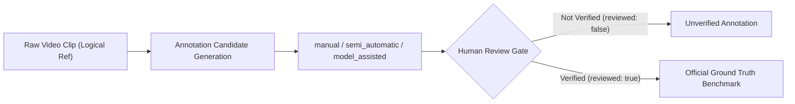

# SportsScout Shuttlecock Benchmark & Ground-Truth Protocol (Phase 2.0)

## 1. Overview & Purpose
Phase 2 focuses exclusively on **shuttlecock tracking**.
Before implementing any shuttle AI detector (such as TrackNet, YOLO shuttle detector, or trajectory estimators), Phase 2.0 establishes a reproducible, scientifically disciplined evaluation benchmark and ground-truth annotation protocol.

Unlike player tracking (which tracks grounded athletes moving on a 2D floor surface), shuttlecock tracking presents unique vision challenges:
- High velocities (>300 km/h during smashes), causing severe motion blur or multi-frame elongation streaks.
- Small pixel footprint (often $4 \times 4$ to $12 \times 12$ pixels on 1080p footage).
- Rapid occlusions behind athlete bodies, rackets, and net tape.
- Low-contrast background interference (arena lights, spectator clothing, white sponsor boards).
- True 3D airborne trajectories across varying camera viewing angles.

> **Phase 2.0 Core Rule**: No shuttle AI tracker, detector, smoothing, or hit detection is implemented in this phase. This phase defines the measurement instrument and ground-truth contract.

---

## 2. Benchmark Clips & Manifest Structure

### Logical Reference Rule (No Git Binaries)
- **Large video binaries are NEVER committed to Git.**
- Video clips are referenced by stable logical identifiers (`id`) and relative logical file paths (`videoReference`).
- Recommended initial duration: **10–30 seconds** per clip. Short clips are intentional because frame-by-frame shuttle ground-truth annotation is labor-intensive and costly.

### Standard Categories (Initial S01–S05)
| Category ID | Clip ID | Match Type | Target Split | Duration | Evaluation Focus |
| :--- | :--- | :--- | :--- | :--- | :--- |
| **S01** | `S01_singles_clear_rally` | Singles | `development` | 15s | High clears, baseline drops, high contrast baseline trajectory. |
| **S02** | `S02_singles_fast_smash` | Singles | `development` | 12s | Steep smashes (>300 km/h), severe motion blur streaks, fast defensive blocks. |
| **S03** | `S03_doubles_standard` | Doubles | `validation` | 20s | Rapid midcourt flat drive exchanges between 4 athletes. |
| **S04** | `S04_doubles_occlusion` | Doubles | `test` | 18s | Repetitive body overlaps, partner crossing line-of-sight, net tape occlusion. |
| **S05** | `S05_difficult_broadcast` | Singles | `test` | 25s | Dynamic broadcast pan/tilt camera, crowd background, far-court perspective. |

---

## 3. How to Add a Shuttle Benchmark Clip

1. Store the video file in your local workspace data directory (e.g. `benchmarks/videos/shuttle/S06_custom.mp4`).
2. Add a clip entry to [`src/benchmarks/shuttleBenchmarkManifest.json`](file:///c:/Users/Sport-Science-R3909/Documents/GitHub/Sports-cout-/src/benchmarks/shuttleBenchmarkManifest.json) or construct one using `createShuttleBenchmarkClip(...)`:
   ```json
   {
     "id": "S06_singles_lighting_glare",
     "name": "Singles / Lighting Glare",
     "category": "S01",
     "sport": "badminton",
     "gameType": "singles",
     "split": "validation",
     "playerCount": 2,
     "videoReference": "benchmarks/videos/shuttle/S06_singles_lighting_glare.mp4",
     "durationSec": 16.0,
     "sourceWidth": 1920,
     "sourceHeight": 1080,
     "sourceFps": 60.0,
     "cameraType": "static_rear",
     "cameraMotion": "static",
     "difficultyTags": ["white_background", "motion_blur"],
     "groundTruthAvailable": false,
     "notes": "Testing shuttle detection against stadium overhead spotlight glare.",
     "knownDifficultSegments": [
       {
         "startSec": 6.2,
         "endSec": 8.0,
         "tags": ["white_background"],
         "description": "Shuttle enters overhead luminaire zone"
       }
     ]
   }
   ```
3. Run `validateShuttleBenchmarkClip(clip)` in TypeScript or `clip.validate()` in Python to verify schema compliance.

---

## 4. Ground-Truth Annotation Contract

Each annotated frame is represented by `ShuttleGroundTruthFrame`:
```typescript
interface ShuttleGroundTruthFrame {
  frameIndex: number;          // 0-indexed video frame number
  timestampSec: number;        // Frame presentation timestamp in seconds
  visibility: ShuttleVisibility; // 'visible' | 'occluded' | 'not_visible' | 'unknown'
  xPx: number | null;          // Native image pixel X coordinate (null if unseen)
  yPx: number | null;          // Native image pixel Y coordinate (null if unseen)
  xNormalized?: number | null; // Optional normalized [0.0, 1.0] coordinate
  yNormalized?: number | null; // Optional normalized [0.0, 1.0] coordinate
  annotationSource?: ShuttleAnnotationSource | null; // 'manual' | 'semi_automatic' | 'model_assisted'
  reviewed?: boolean | null;   // Must be true for verified benchmark evaluation
  notes?: string | null;       // Optional human annotation notes
}
```

### Visibility Semantics
- **`visible`**: The shuttlecock is directly visible in the frame (including motion-blurred streaks). `xPx` and `yPx` **must be valid non-negative numbers** marking the estimated centroid of the shuttle head/skirt.
- **`occluded`**: The shuttlecock is physically present in the camera frustum but obscured by a player's body, racket, net post, or net tape. `xPx` and `yPx` may optionally contain an estimated position if known by temporal interpolation, or remain `null`.
- **`not_visible`**: The shuttlecock is completely out of frame, obscured by an opaque obstacle, or masked by off-court banners. `xPx` and `yPx` **MUST be null**.
- **`unknown`**: An ambiguous frame where the annotator cannot ascertain whether the shuttle is present or hidden. `xPx` and `yPx` **MUST be null**.

### No Fake Zero Coordinate Rule
> [!CAUTION]
> **Never represent an invisible shuttle as `(0, 0)`.**
> `(0, 0)` is a real pixel coordinate representing the top-left corner of the video. Storing `(0, 0)` for missing observations corrupts downstream tracking metrics, distance error calculations, and heatmap projections. Unknown or missing coordinates must strictly remain `null` (Python: `None`). The schema validator explicitly rejects `(0, 0)` when visibility is `not_visible` or `unknown`.

---

## 5. Why Court Homography is NOT Directly Used

In player tracking, player feet contact the 2D court floor plane ($Z = 0$). A 4-point planar perspective homography $H$ maps pixel coordinates $(u, v)$ to metric court coordinates $(X, Y)$:

$$\begin{bmatrix} X \\ Y \\ 1 \end{bmatrix} \sim H^{-1} \begin{bmatrix} u \\ v \\ 1 \end{bmatrix}$$

### The Airborne Parallax Problem
Badminton shuttlecocks are **airborne** throughout play, reaching altitudes between $0.0\,\text{m}$ and $8.0\,\text{m}$ above the court surface:
1. Ground homography $H$ maps the intersection of the camera viewing ray with the ground plane $Z = 0$.
2. When the shuttlecock is at altitude $Z > 0$, the camera ray passes through the shuttle in 3D space and continues until it intersects the floor plane far behind or away from the shuttle's true $(X, Y)$ ground footprint.
3. The resulting projected point $(\tilde{X}, \tilde{Y})$ incurs a displacement error proportional to shuttle height $h$ and camera viewing angle $\theta$:
   $$\Delta \approx h \cdot \tan(\theta)$$
   For a camera mounted at a $25^\circ$ angle, a high clear at $h = 6\,\text{m}$ produces over **$2.8\,\text{meters}$ of false displacement** on the court floor!

> [!IMPORTANT]
> **Invariant**: Ground-truth shuttle position is **IMAGE SPACE FIRST** (`xPx`, `yPx`).
> Direct projection of airborne shuttle image coordinates through the 2D player-feet court homography is mathematically false and strictly prohibited.
> Future phases will estimate court events (such as shuttle contact and bounce locations) using specialized trajectory intersection and event inference.

---

## 6. Difficult Segments & Tagging Taxonomy

Benchmark clips feature tagged intervals (`knownDifficultSegments`) to isolate performance across critical failure modes:
- **`smash`**: High-velocity downward drives exceeding 250 km/h.
- **`motion_blur`**: Rapid movement creating directional smearing across multiple pixels.
- **`shuttle_near_player`**: Shuttle within proximity of athlete torso, limbs, or swinging racket.
- **`body_occlusion`**: Player body directly blocking direct line of sight to shuttle.
- **`net_occlusion`**: Shuttle passing through net mesh or hidden behind net tape.
- **`camera_motion`**: Panning, tilting, or zooming camera frames.
- **`far_court`**: Shuttle at far baseline appearing under 6 pixels in diameter.
- **`white_background`**: Shuttle traversing white ceiling girders, advertising panels, or lights.
- **`crowd_background`**: Visual clutter from spectator movements in background.
- **`lost_reacquisition`**: Emergence of shuttle after extended occlusion.

---

## 7. Dataset Splits & Provenance Workflow

### Dataset Splits
- **`development`** (e.g. S01, S02): For exploratory algorithm development, hyperparameter tuning, and threshold selection.
- **`validation`** (e.g. S03): For regression testing and cross-validation across architectures.
- **`test`** (e.g. S04, S05): Held-out stress benchmarks for unbiased final evaluation.

### Provenance Workflow

1. Annotations can originate from `manual` clicking, `semi_automatic` interpolation, or `model_assisted` proposal.
2. For an annotation set to qualify for official benchmark evaluation, each frame must pass human inspection with `reviewed: true`.
